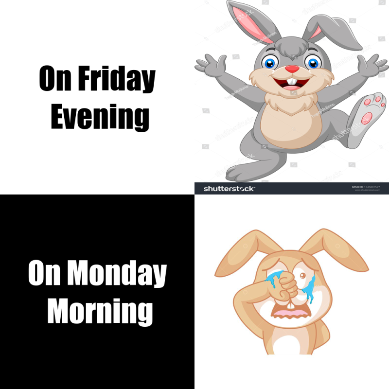

# Welcome to my STATS 220 Github Page!
# Introduction to my meme
1)This meme is made by R studio by using the package "magick"

2)This meme has show the comparison between my mood on Friday evening and Monday Morning.
  Usually, I feel nervous and stressful on Mondaly mornings, but relax and happy on Friday evenings.
  
3)Because my favourite animal is rabbits. So I have using a [happy rabbit](https://image.shutterstock.com/z/stock-vector-cartoon-happy-rabbit-isolated-on-white-background-1345801577.jpg) and a [crying rabbit](https://preview.pixlr.com/images/800wm/100/1/1001467992.jpg) as part of my meme. 



## Method used to make this meme
The following r code is being used for making my meme.

```{r}
library("magick")
library("tidyverse")

#first meme
On_Friday_Evening<-image_read("https://image.shutterstock.com/z/stock-vector-cartoon-happy-rabbit-isolated-on-white-background-1345801577.jpg") %>%
image_resize("500x500!")

#second meme
On_Monday_Morning<-image_read("https://preview.pixlr.com/images/800wm/100/1/1001467992.jpg") %>%
  image_resize("500x500!")

#first text
           #the box
Friday_text <- image_blank(width=500, height=500, color="#FFFFFF") %>%
image_annotate(text="On Friday\n Evening", color="#000000", size=80, font="Impact", gravity="center")

Monday_text<-image_blank(width=500, height=500, color="#000000")%>%
image_annotate(text="On Monday\n Morning", color="#FFFFFF", size=80, font="Impact", gravity="center")

top_row<-image_append(c(Friday_text,On_Friday_Evening))

bottom_row<-image_append(c(Monday_text, On_Monday_Morning))

Meme<-c(top_row, bottom_row) %>%
  image_append(stack=TRUE) %>%
  image_scale(800)

Meme
```
